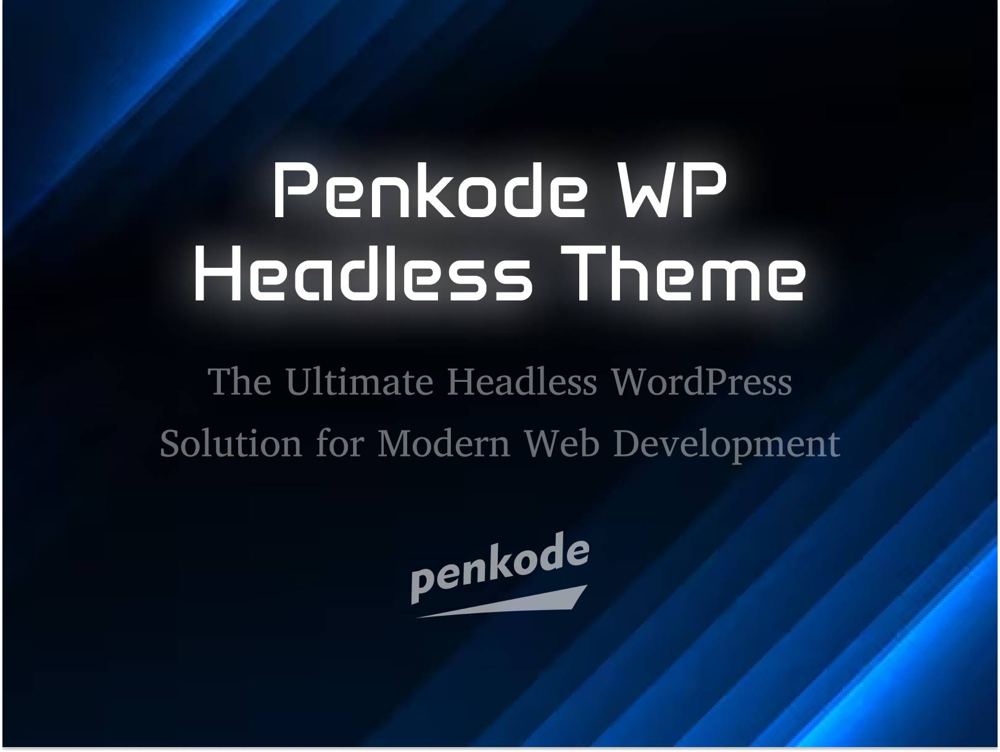

# Penkode Headless Framework

**WordPress Headless for projects with a React frontend.**

---

## General Structure

- **Backend:** WordPress with a custom theme `penkode-headless`, featuring advanced headless functionalities.  
- **Frontend:** Separate project (`next-wp-kit`) consuming the WordPress API.  
- **Multilingual:** Full WPML support with translation endpoints.

---

## Main Features

### Custom REST API

Over 15 endpoints at `/wp-json/custom/v1`, including:

- Unified menus  
- Custom search  
- Post navigation (prev/next)  
- Active popups  
- Site information  
- Like system  
- Hero section data  
- WPML language support  

### Custom Post Types Integration

All custom post types (CPTs) created in WordPress **automatically appear in the Next.js/React frontend** via the API, no additional frontend setup required.

### Text-to-Speech (TTS)

Automatic audio generation for configured post types using Google Translate TTS API.

**Features:**
- Generates MP3 files automatically when saving posts
- Supports multiple languages via WPML taxonomy
- Audio files stored in `/wp-content/uploads/mp3/`
- API includes `audio_url` for frontend consumption
- Configurable for any post type (currently: `recursos`, `noticias`)

**Setup:**
1. Install Composer dependencies: `composer install`
2. Audio generates automatically on post publish
3. Frontend displays audio player for posts with audio

### Additional Features

- Advanced custom fields
- Custom taxonomies
- Preview system
- GraphQL integration
- CORS setup for local development (`localhost:3000`)

---

## Configuration

- Uses **Composer** for PHP dependencies  
- Setup included for **Local by Flywheel**  
- Configuration files for **nginx, PHP, and MySQL**  

---
